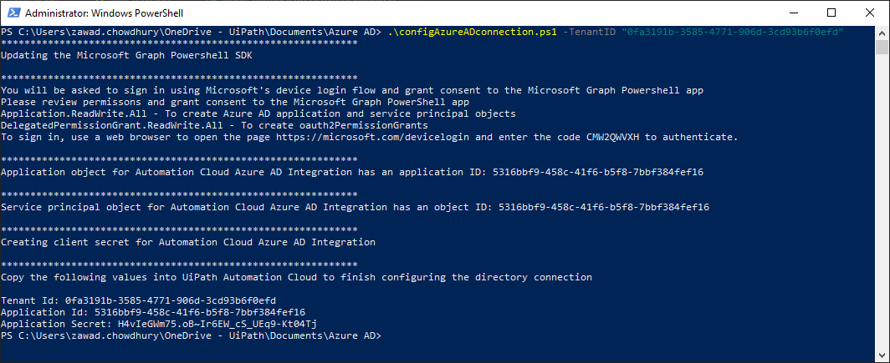

# Azure AD Integration
These scripts will help you automate and test the Azure AD application registration used to configure the directory integration between your Automation Cloud Organization and your Azure AD or Office 365 tenant.

## Scripts
- [config-azure-ad-connection.ps1](##config-azure-ad-connection.ps1)
- [test-azure-ad-app-registration.ps1](##test-azure-ad-app-registration.ps1)

## [config-azure-ad-connection.ps1](config-azure-ad-connection.ps1)
This script will automatically create and configure an app named Automation Cloud Azure AD Integration, and return the parameters needed to configure the connection (Azure AD Tenant ID, AppID, Client Secret).

### Prerequisites: 
- Azure AD tenant 
- Access to an Azure AD Global Administrator, Cloud Application Administrator, or Application Administrator. 
- The script expects you don’t have an existing Azure AD app registration named Automation Cloud Azure AD Integration

### Configuration steps: 
1. Run the PowerShell Script as an Administrator:
```Powershell
# Automation Cloud setup
.\config-azure-ad-connection.ps1 -TenantID "Your Azure AD TenantID" -Platform "AutomationCloud"
# Automation Suite setup
.\config-azure-ad-connection.ps1 -TenantID "Your Azure AD TenantID" -Platform "AutomationSuite" -AutomationSuiteFQDN "Your AutomationSuite FQDN"
```
2. You will be asked to sign in using Microsoft's device login flow and grant consent to the Microsoft Graph Powershell App


3. Copy the authentication code and enter it in [https://microsoft.com/devicelogin](https://microsoft.com/devicelogin)


4. Sign in to your Azure AD Administrator account and grant consent to the Microsoft Graph PowerShell app


5. Let the script run and generate the required Tenant ID, Application ID, and Application Secret


6. Finally copy and paste the Azure AD Configuration values into Automation Cloud Portal


## [test-azure-ad-app-registration.ps1](test-azure-ad-app-registration.ps1)
This script will test your Azure AD app registration that you configured to ensure all the properties are configured properly.

### Prerequisites: 
- Azure AD tenant 
- Access to an Azure AD Global Administrator, Cloud Application Administrator, or Application Administrator
- The script expects you have an existing Azure AD App Registration

### Configuration steps: 
1. Run the PowerShell Script as an Administrator:
```Powershell
# Automation Cloud
.\test-azure-ad-app-registration.ps1 -TenantID "Your Azure AD tenant ID" -AppId "Your Automation Cloud Azure AD Integration application ID" -Platform "AutomationCloud"
# Automation Suite
.\test-azure-ad-app-registration.ps1 -TenantID "Your Azure AD tenant ID" -AppId "Your Automation Suite Azure AD Integration application ID" -Platform "AutomationSuite" -AutomationSuiteFQDN "Your AutomationSuite FQDN"
```

2. You will be asked to sign in using Microsoft's device login flow and grant consent to the Microsoft Graph Powershell App

3. Copy the authentication code and enter it in [https://microsoft.com/devicelogin](https://microsoft.com/devicelogin)

4. Sign in to your Azure AD Administrator account and grant consent to the Microsoft Graph PowerShell app

5. Let the script run and document discrepancies in the app registration

6. If there are discrepancies, the script will offer to fix them for you! You can answer reply Y for yes or N for no.

